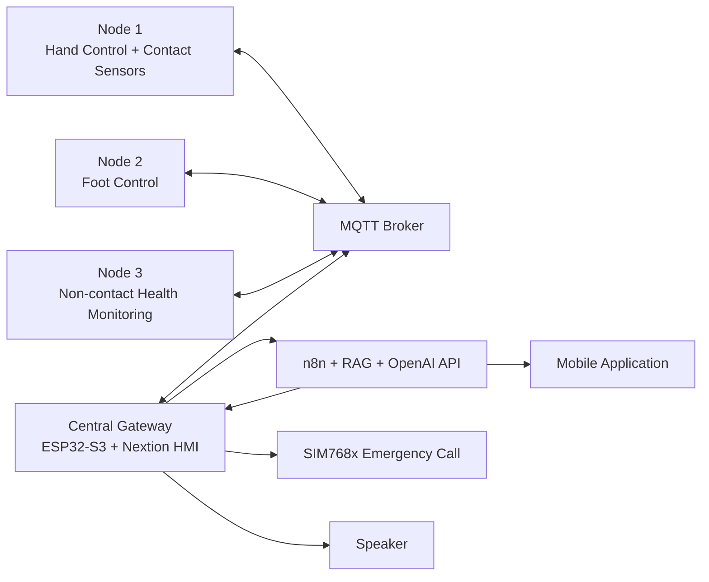

# AI-Powered Communication Assistance and Health Monitoring System for Stroke Patients

An ESP32-S3-based IoT system designed to help stroke patients communicate their daily needs and support caregivers in monitoring health conditions at home.

The system combines a 7-inch Nextion HMI, hand and foot control devices, contact and non-contact biomedical sensors, MQTT communication, a mobile application, and AI-assisted analysis using RAG.

> **Medical disclaimer:** This project is a prototype for monitoring and decision support. It does not diagnose diseases or replace doctors and medical devices.

## Main Features

### Communication Assistance

- Direct control through a 7-inch Nextion touchscreen
- Joystick control for patients who can move one hand
- Five foot buttons for patients with upper-body paralysis
- Quick communication phrases for common daily needs
- AI-generated sentence suggestions based on entered characters or keywords
- Text-to-speech output through an external speaker
- Suggestion history used to prioritize frequently selected phrases

### Health Monitoring

- Contact measurement of heart rate, SpO2, and body temperature
- Non-contact measurement of heart rate, breathing rate, and body temperature
- Real-time data transmission between sensor nodes and the central gateway
- Health information displayed on the Nextion HMI and mobile application
- AI-assisted analysis using current vital signs, health trends, and patient history
- Short and detailed supportive assessments for caregivers

### Emergency Support

- Physical and on-screen emergency controls
- Emergency calls or notifications through an MKE-M21 SIM768x 4G module
- Independent cellular communication when Internet access is unavailable

## System Architecture

The system consists of four ESP32-S3 nodes connected through Wi-Fi and MQTT.



## Hardware

### Central Gateway

- ESP32-S3 development board
- Nextion NX8048P070 7-inch HMI
- Audio amplifier and speaker
- MKE-M21 SIM768x 4G SMS/Call module
- 12 V adapter and LM2596 power converter

### Node 1 - Hand Control and Contact Monitoring

- ESP32-S3 SuperMini
- Joystick module
- MAX30102 heart-rate and SpO2 sensor
- DS18B20 contact temperature sensor
- Rechargeable battery and power circuit

### Node 2 - Foot Control

- ESP32-S3 SuperMini
- Five mechanical foot buttons
- Rechargeable battery and power circuit

### Node 3 - Non-contact Monitoring

- ESP32-S3 SuperMini
- R60ABD1 radar sensor
- GY-906 / MLX90614 infrared temperature sensor
- Rechargeable battery and power circuit

## Communication Interfaces

| Connection | Protocol |
|---|---|
| Sensor nodes to central gateway | MQTT over Wi-Fi |
| Nextion HMI to ESP32-S3 | UART |
| MAX30102 and temperature sensors | I2C / OneWire |
| R60ABD1 radar to ESP32-S3 | UART |
| Central gateway to AI server | HTTP webhook |
| SIM module to ESP32-S3 | UART and AT commands |
| Audio output | I2S |
| Mobile application to server | HTTP / Webhook |

## Software and Technologies

- C and C++
- Arduino IDE
- ESP32 / ESP32-S3
- MQTT
- HTTP
- UART, I2C, SPI, GPIO, ADC, and I2S
- Nextion Editor
- Python
- n8n
- Retrieval-Augmented Generation (RAG)
- OpenAI API
- DigitalOcean VPS
- Mobile health-monitoring application
- Altium Designer / PCB design tools

## Operating Workflow

### Communication Mode

1. The patient controls the interface using touch, a joystick, or foot buttons.
2. The selected characters or keywords are sent to the central gateway.
3. The gateway sends a request to the AI workflow.
4. The AI returns suitable communication suggestions.
5. Suggestions are displayed on the Nextion screen.
6. The selected sentence is played through the speaker.

### Health Monitoring Mode

1. The user selects contact or non-contact measurement.
2. The corresponding sensor node collects vital-sign data.
3. Data is transmitted to the central gateway through MQTT.
4. The gateway displays the measured values on the HMI.
5. The health data is sent to the n8n and RAG workflow for analysis.
6. A short assessment is displayed on the HMI and mobile application.
7. A detailed explanation is available for the caregiver.

### Emergency Mode

1. The patient presses a physical or virtual emergency button.
2. The central gateway sends AT commands to the 4G module.
3. The module calls or notifies a preconfigured caregiver contact.

## PCB Design

The project includes separate PCB designs for:

- Central gateway
- Hand-control and contact-sensor node
- Foot-control node
- Non-contact health-monitoring node

Add the schematic, PCB layout, 3D views, and manufactured boards to the repository to demonstrate the complete hardware-development process.

## Experimental Results

The project was evaluated through communication-assistance and health-monitoring tests.

### Communication Suggestions

- The suggestion system was tested more than 20 times.
- Initial suggestions were general, but later results became more relevant to the user's needs.
- In the final trials, short inputs such as `m` produced useful suggestions including resting, drinking water, and changing position.

### Health Monitoring

Twenty consecutive tests produced valid analysis results without data loss or interruption.

| Measurement | Reported Error |
|---|---:|
| Heart rate | ±10 bpm |
| Breathing rate | ±3 breaths/min |
| SpO2 | ±2% |
| Contact temperature | ±0.2°C |
| Non-contact temperature | ±0.5°C |

- Overall comparison accuracy against the selected reference thresholds: approximately **80%**
- AI processing time after measurement: approximately **10 seconds**
- The distributed nodes and central server maintained stable communication during testing

## Repository Structure

A simple one-level repository structure can be used:

```text
stroke-patient-assistance-system/
├── gateway.ino
├── hand-control-node.ino
├── foot-control-node.ino
├── non-contact-node.ino
├── nextion-interface.HMI
├── n8n-workflow.json
├── mobile-app-source.zip
├── system-architecture.png
├── gateway-pcb.png
├── node1-pcb.png
├── node2-pcb.png
├── node3-pcb.png
├── prototype.jpg
├── project-report.pdf
└── README.md
```

Only include files that are actually available in the project.

## Setup

### Embedded Devices

1. Install the ESP32 board package in Arduino IDE.
2. Install the required sensor, MQTT, HTTP, JSON, Nextion, and audio libraries.
3. Open each node firmware file.
4. Configure the Wi-Fi network, MQTT broker, topics, GPIO pins, and server URL.
5. Upload the correct firmware to the gateway and each sensor/control node.
6. Upload the HMI project to the Nextion display.
7. Confirm that all nodes connect to the MQTT broker.

### AI Server

1. Deploy an n8n instance on a VPS.
2. Import the project workflow.
3. Configure the OpenAI API credential.
4. Add the RAG documents used for supportive health analysis.
5. Configure the webhook URL in the ESP32-S3 gateway firmware.
6. Test the webhook using sample health data before connecting the sensors.

## Security Notice

Before publishing the repository, remove or replace:

- Wi-Fi SSID and password
- MQTT username and password
- OpenAI API key
- Webhook URLs
- VPS IP address and credentials
- SIM phone numbers
- Patient names, medical history, and personal health data

Store secrets in local configuration files that are excluded through `.gitignore`.

## Limitations

- The current interface requires the patient to move at least one finger or one foot.
- The system is not suitable for completely paralyzed patients without another input method.
- Biomedical sensors can be affected by movement, placement, ambient light, and temperature.
- AI responses depend on the quality of retrieved documents and patient data.
- Internet access is required for cloud-based AI analysis.
- The prototype has not been certified as a medical device.

## Future Development

- Integrate higher-accuracy biomedical sensors
- Improve filtering and sensor-signal processing
- Add eye tracking, head movement, or gesture control
- Personalize communication suggestions for each patient
- Improve long-term health-trend analysis
- Simplify the interface for elderly users
- Add larger buttons, clearer icons, and shorter interaction flows
- Add offline data storage and automatic synchronization
- Improve enclosure design, power management, and PCB protection
- Add remote monitoring for caregivers and rehabilitation centers

## Project Images

After uploading the corresponding image files, add them to this README:

```markdown


```

## Author

**Nguyễn Huỳnh Khánh Lâm**  
Electronics and Telecommunications Engineering  
Ton Duc Thang University

## License

This repository is intended for educational and research purposes.
